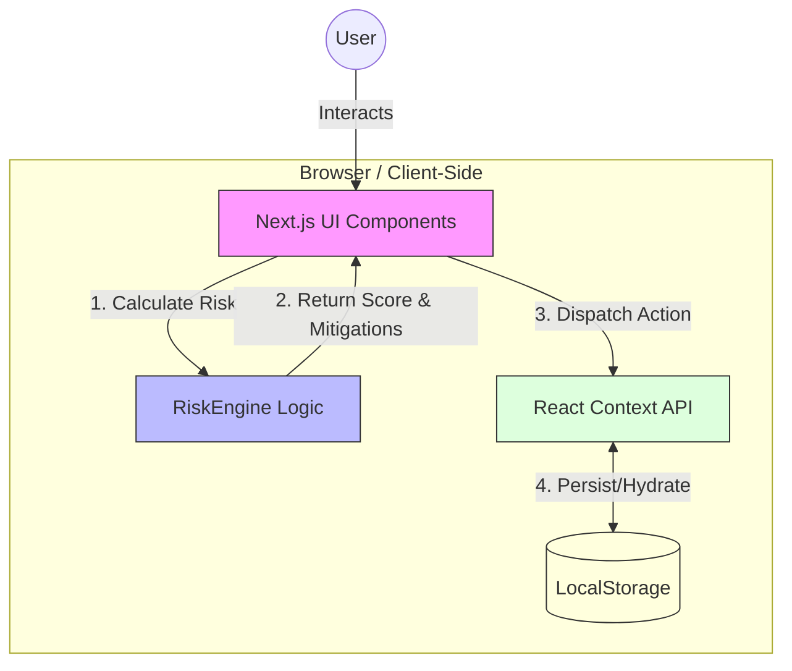

# VendorGuard Lite 🛡️

**VendorGuard Lite** is a modern, automated Vendor Risk Management (VRM) platform designed to streamline the assessment and tracking of third-party security risks. 

It moves GRC from manual spreadsheets to an automated, algorithmic approach, dynamically calculating risk scores and prescribing remediation controls (ISO 27001 / SOC 2) based on vendor attributes.


## 🛠️ Tech Stack

*   **Framework**: [Next.js 16](https://nextjs.org/) (App Router)
*   **Language**: TypeScript
*   **Styling**: [Tailwind CSS](https://tailwindcss.com/) (Glassmorphism & Dark Mode)
*   **Icons**: Lucide React
*   **State**: React Context API + LocalStorage

## 🏗️ Architecture

The application follows a secure, client-side architecture designed for privacy and zero-infrastructure deployment.



## 🚀 Key Features

### 1. Algorithmic Risk Scoring
Stop guessing. The **Risk Engine** (`/lib/riskEngine.ts`) automatically calculates a risk score (0-100) and tier (Low/Medium/Critical) based on weighed factors:
*   **Data Sensitivity**: Does the vendor store PII? (+40 points)
*   **System Criticality**: Is it a critical dependency? (+30 points)
*   **Access Level**: Read vs. Admin access? (+10 to +30 points)
*   **Mitigating Controls**: Does the vendor have a SOC 2 report? (-30 points)

### 2. Intelligent Mitigation Mapping
The system doesn't just identify risk; it suggests solutions. It automatically maps risks to industry standard controls:
*   **PII Detected** → Suggests **ISO 27001 A.18.1.4** (Privacy & DPA)
*   **Admin Access** → Suggests **SOC 2 CC6.3** (MFA & SSO)
*   **No SOC 2** → Suggests **VRM.1** (Security Questionnaire)

### 3. Vendor Registry & Dashboard
*   **Risk Heatmap**: Visualize high-risk vendors instantly.
*   **Persistence**: Data is saved locally (`localStorage`), allowing you to track vendors over time.
*   **Detailed Profiles**: Deep-dive pages for every vendor showing their full risk breakdown.


## 🏁 Getting Started

1.  **Clone the repository**:
    ```bash
    git clone https://github.com/yourusername/vendor-guard.git
    cd vendor-guard
    ```

2.  **Install dependencies**:
    ```bash
    npm install
    ```

3.  **Run the development server**:
    ```bash
    npm run dev
    ```

4.  Open [http://localhost:3000](http://localhost:3000) with your browser.

## 🕹️ Usage Guide

### 1. Dashboard
The main landing page gives you a bird's-eye view of your vendor landscape.
- **Key Metrics**: Total vendors, critical risks count, and average risk score.
- **Risk Heatmap**: A list of high-risk vendors requiring immediate attention.
- **Recent Activity**: A timeline of generic activity.

### 2. Risk Assessment Calculator
Navigate to the **Assessments** tab to score a new vendor.
- **Interactive Form**: Input vendor details like "Stores PII", "Critical System", and "SOC2 Compliance".
- **Real-time Scoring**: The proprietary `RiskEngine` calculates a score (0-100) and assigns a tier (Low, Medium, Critical).
- **Mitigation Engine**: Automatically suggests ISO 27001 and SOC 2 controls (e.g., "Verify Encryption", "Enforce MFA") based on the specific risks identified.
- **Save to Registry**: Once assessed, you can save the vendor to your local repository.

### 3. Vendor Registry & Details
Navigate to the **Vendor Registry** tab to see all vendors.
- **Persistence**: Vendors are saved to your browser's LocalStorage, so they persist across refreshes.
- **Detailed Profiles**: Click on any vendor to view their full risk breakdown, service details, and onboarding date.
- **Remediation Plan**: View the specific list of required security controls for each vendor.

